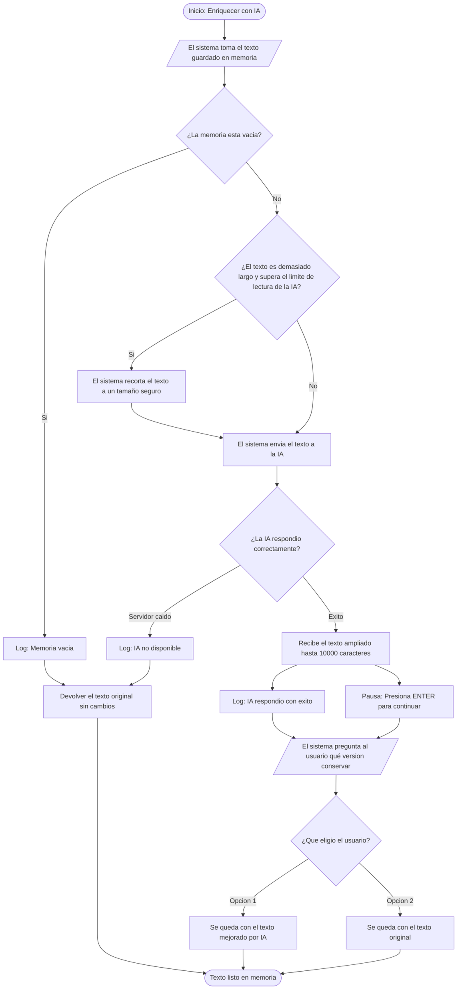

# Documentación Técnica y Guía de Estudio: Módulo AiContentEnricher

Esta documentación recopila de manera integral la arquitectura, diseño, implementación, pruebas, análisis de dependencias estáticas y control de versiones del módulo `AiContentEnricher`, desarrollado dentro del proyecto backend `content-enrichment-backend`.

---

## 1. Definición y Propósito del Sistema

### ¿Qué es esta herramienta?
`AiContentEnricher` es un servicio backend desarrollado en Python encargado de transformar y elevar la calidad pedagógica de contenidos textuales (procedentes del módulo de scraping de Wikipedia) mediante Modelos de Lenguaje Grande (LLMs). 

### ¿Qué problema resuelve?
* **Ampliación didáctica:** Convierte resúmenes o párrafos enciclopédicos concisos en explicaciones ricas en conceptos clave, fórmulas técnicas y contexto histórico.
* **Tolerancia a fallos (*Graceful Degradation*):** Garantiza que la aplicación nunca se interrumpa por caídas de red, cuotas agotadas o errores de API; si la inteligencia artificial falla, el sistema devuelve intacto el texto original sin provocar errores críticos.
* **Control de decisiones del usuario:** Ofrece un punto de decisión en memoria donde el usuario revisa la salida generada y decide explícitamente si conserva el texto enriquecido por la IA o prefiere mantener la versión original antes de continuar en el pipeline.

---

## 2. Conceptos Clave y Glosario Técnico

* **Degradación Elegante (*Graceful Degradation*):** Capacidad de un sistema de continuar funcionando a un nivel reducido en lugar de colapsar cuando parte de sus componentes externos fallan.
* **Mocking:** Técnica de pruebas unitarias que simula el comportamiento de servicios externos (como la API de OpenAI o Groq) para evaluar la lógica interna sin realizar peticiones reales a la red ni consumir saldo.
* **Hardcoding vs. Parametrización Dinámica:** Se denomina *hardcoding* a la mala práctica de incrustar valores fijos o sensibles (como contraseñas, URLs o textos de negocio) directamente en el código fuente productivo. En contraste, un sistema desacoplado consume configuraciones mediante variables de entorno, inyección de dependencias o parámetros con valores predeterminados.
* **Conventional Commits:** Estándar formal para redactar mensajes de confirmación en Git (por ejemplo: `feat:`, `test:`, `refactor:`, `chore:`), facilitando la trazabilidad y la integración continua.
* **Inferencia de LLM:** Proceso mediante el cual un modelo de lenguaje procesa un texto de entrada (*prompt*) y calcula la respuesta probabilística correspondiente.
* **Groq Cloud:** Plataforma de cómputo de inferencia que proporciona compatibilidad total con la especificación de la API de OpenAI, permitiendo utilizar modelos abiertos de alta potencia a latencias mínimas.

---

## 3. Arquitectura del Módulo y Diagrama de Flujo

### Gráfico del Flujo Lógico


## 4. Implementación del Código Productivo

### Archivo: `src/enricher.py`

```python
import logging
import os
from dotenv import load_dotenv
from openai import OpenAI

load_dotenv()

# Logger configurado según las especificaciones del flujo
logger = logging.getLogger(__name__)
if not logger.handlers:
    handler = logging.StreamHandler()
    formatter = logging.Formatter("[%(levelname)s] %(message)s")
    handler.setFormatter(formatter)
    logger.addHandler(handler)
    logger.setLevel(logging.INFO)


class AiContentEnricher:
    """Servicio responsable de enriquecer y resumir texto mediante modelos de IA."""

    def __init__(self, api_key: str | None = None, base_url: str | None = None) -> None:
        """Inicializa el cliente OpenAI validando credenciales y URL base."""
        self.api_key = api_key or os.getenv("OPENAI_API_KEY")
        self.base_url = base_url or os.getenv("OPENAI_BASE_URL")

        if not self.api_key:
            raise ValueError(
                "API key not found. Ensure it is configured in .env or passed to constructor."
            )

        self.client = OpenAI(
            api_key=self.api_key,
            base_url=self.base_url,
        )

    def _is_valid_text(self, text: str | None) -> bool:
        """Valida que la entrada contenga caracteres no vacíos."""
        if not text or not isinstance(text, str):
            return False
        return bool(text.strip())

    def _adjust_length(self, text: str, max_characters: int = 10000) -> str:
        """Recorta de forma segura el texto si supera la longitud máxima."""
        if len(text) > max_characters:
            return text[:max_characters].strip()
        return text

    def enrich_content(self, text: str, model: str = "qwen/qwen3.8-27b") -> str:
        """Enriquece el contenido pedagógicamente invocando la IA."""
        if not self._is_valid_text(text):
            logger.warning("Memoria vacía")
            return text

        prepared_text = self._adjust_length(text)

        system_prompt = (
            "Eres un asistente educativo especializado en investigación y síntesis académica. "
            "Tu tarea es enriquecer el contenido proporcionado: amplía los conceptos clave, "
            "añade contexto histórico o técnico relevante y organiza la información con claridad, "
            "manteniendo un tono didáctico, riguroso y estructurado."
        )

        try:
            response = self.client.chat.completions.create(
                model=model,
                messages=[
                    {"role": "system", "content": system_prompt},
                    {"role": "user", "content": f"Contenido a enriquecer:\n\n{prepared_text}"},
                ],
                temperature=0.7,
            )
            enriched_content = response.choices[0].message.content
            if enriched_content:
                logger.info("IA respondió con éxito")
                return enriched_content.strip()

            logger.warning("IA no disponible")
            return text
        except Exception:
            logger.warning("IA no disponible")
            return text

    def summarize_content(self, text: str, model: str = "qwen/qwen3.8-27b") -> str:
        """Genera un resumen analítico estructurado a partir del texto de entrada."""
        if not self._is_valid_text(text):
            logger.warning("Memoria vacía")
            return text

        prepared_text = self._adjust_length(text)

        system_prompt = (
            "Eres un asistente educativo especializado en síntesis de información. "
            "Tu tarea es generar un resumen conciso y estructurado del contenido proporcionado, "
            "destacando los puntos principales, definiciones clave y conclusiones esenciales."
        )

        try:
            response = self.client.chat.completions.create(
                model=model,
                messages=[
                    {"role": "system", "content": system_prompt},
                    {"role": "user", "content": f"Contenido a resumir:\n\n{prepared_text}"},
                ],
                temperature=0.5,
            )
            summary = response.choices[0].message.content
            if summary:
                logger.info("IA respondió con éxito")
                return summary.strip()

            logger.warning("IA no disponible")
            return text
        except Exception:
            logger.warning("IA no disponible")
            return text
        ```
```
---
# 5. Auditoría de Buenas Prácticas: Desacoplamiento y Cero Hardcoding
Uno de los pilares de este desarrollo es garantizar que ningún dato crítico o de negocio quede acoplado en el código:
## 1. En el módulo productivo (src/enricher.py)
Credenciales 100% dinámicas: No existen claves de API ni URLs expuestas en el código fuente. Se recuperan en tiempo de ejecución desde variables de entorno con os.getenv().

2. Inyección de dependencias: La clase AiContentEnricher admite parámetros opcionales (api_key, base_url) en su constructor __init__, permitiendo conectarse a diferentes proveedores sin modificar su código.

3. Modelo configurable: El parámetro model dispone de un valor predeterminado funcional ("qwen/qwen3.8-27b"), pero puede sobreescribirse en cada llamada al método si se requiere otro modelo.

4. Límites parametrizables: El límite de seguridad de caracteres cuenta con un valor por omisión (max_characters=10000) ajustable según las necesidades de la capa superior.

## 2 . En el script de demostración interactiva (examples/demo_enricher_flow.py)
No contiene temas fijos ni textos precargados: solicita dinámicamente el concepto al usuario mediante input() por consola con validación de no vacíos.

## 3. En la suite de pruebas (tests/test_enricher.py)
Emplea cadenas ficticias para claves de prueba ("sk-fake-test-key") y respuestas simuladas ("Texto enriquecido por IA"), aislándose estrictamente de llamadas reales a la red mediante mocks.

# 6. Configuración de Entorno e Integración con Groq Cloud
Para dotar al sistema de respuestas de IA en tiempo real sin incurrir en costes, se integró el proveedor Groq a través de variables de entorno:
Archivo .env
```
OPENAI_API_KEY=gsk_**************************************
OPENAI_BASE_URL=[https://api.groq.com/openai/v1](https://api.groq.com/openai/v1)
```
Modelo seleccionado: Se configuró qwen/qwen3.8-27b, el cual cuenta con capacidades avanzadas de síntesis didáctica y estructuración formal.

# 7. Suite de Pruebas Unitarias Automatizadas

Archivo: tests/test_enricher.py
Se implementó una batería de 8 tests unitarios con pytest y unittest.mock para verificar de forma aislada e instantánea todos los caminos de ejecución:

## 1.test_initialization_without_key:
Comprueba que se lance ValueError si falta la clave de API.

## 2.test_is_valid_text:
Verifica que cadenas vacías o con solo espacios no sean procesadas.

## 3.test_adjust_length:
Comprueba que textos extensos se recorten estrictamente al límite de seguridad (10.000 caracteres).

## 4.test_enrich_content_invalid_text:
Garantiza que entradas inválidas devuelvan el texto original.

## 5.test_enrich_content_success: 
Valida mediante un mock que la respuesta enriquecida sea extraída y devuelta con éxito.

## 6.test_enrich_content_fallback_error:
Simula un error de red 500 y comprueba que se active la degradación elegante devolviendo el texto original.

## 7.test_summarize_content_success: 
Comprueba la generación y retorno de resúmenes estructurados.

## 8.test_summarize_content_fallback_error: 
Comprueba la degradación elegante en el método de resumen ante caídas de la API.

Resultado de ejecución:
```
python -m pytest -v
============================= 8 passed in 1.67s =============================
```
(Todos los tests aprobados al 100%)[cite: 2].

# 8. Demostración Interactiva en Vivo (Live Demo)
Para la defensa técnica del proyecto ante el equipo y evaluadores, se estructuró un script específico dentro de la carpeta examples/ que solicita el texto por consola de forma dinámica:
Archivo: examples/demo_enricher_flow.py
```
import sys
from pathlib import Path

# Permite resolver importaciones de 'src' independientemente del directorio de ejecución
sys.path.append(str(Path(__file__).resolve().parent.parent))

from src.enricher import AiContentEnricher


def run_manual_flow():
    print("=" * 60)
    print("INTERACTIVE LIVE DEMO: AI CONTENT ENRICHER")
    print("=" * 60)

    # 1. Solicita dinámicamente el texto al usuario por terminal
    original_text = ""
    while not original_text:
        original_text = input("\nIntroduce el texto o concepto a enriquecer: ").strip()
        if not original_text:
            print("⚠️️ El texto no puede estar vacío. Por favor, escribe un concepto.")

    print("\n[Texto capturado dinámicamente]:")
    print(original_text)

    enricher = AiContentEnricher()

    # 2. Solicitud de enriquecimiento a la IA
    print("\nSending text to AI...")
    enriched_text = enricher.enrich_content(original_text)

    print("\n[Result returned by module]:")
    print(enriched_text)

    # 3. Pausa controlada para revisión pedagógica
    input("\nPause: Press ENTER to continue...")

    # 4. Decisión interactiva del usuario
    print("\nSystem question:")
    print("¿Qué versión quieres conservar?")
    print("Option 1: Enriquecida por la IA")
    print("Option 2: Original")

    choice = input("Select an option (1 or 2): ").strip()

    # 5. Asignación definitiva en memoria
    if choice == "1":
        final_memory_text = enriched_text
        print("\n✔ Selected AI enriched text.")
    else:
        final_memory_text = original_text
        print("\n✔ Selected original text.")

    print("\n[Final text ready in memory for next step]:")
    print(final_memory_text)
    print("\n" + "=" * 60)


if __name__ == "__main__":
    run_manual_flow()
```
# 9. Registro de Commits y Control de Versiones

Todo el proceso de desarrollo en la rama feature/aiContentEnricher fue registrado con trazabilidad estricta bajo el estándar Conventional Commits:   
```
test: add unit tests with mocks for enricher module (aa2c720)[cite: 1]
Creación de tests/test_enricher.py cubriendo validaciones, recortes, llamadas simuladas y tolerancia a fallos[cite: 1].
```
```
feat: add interactive flow demo script and refactor enricher methods (c066a6a)
```
```
Refactorización integral del código a inglés técnico y nomenclatura snake_case.
```
```
Incorporación de manejadores de logging según estados de flujo ([INFO] y [WARNING]).
```
```
Creación del directorio examples/ y adición inicial de la demo.
```
```
chore: remove redundant manual test file from root (1efd670
Limpieza del archivo temporal duplicado en la raíz para mantener la estructura del repositorio ordenada y limpia
```
```
feat: make demo enricher script dynamic with interactive terminal prompt
Adaptación del script de demo para capturar el concepto en vivo por consola sin hardcoding.
```
```
docs: add comprehensive study guide and technical architecture for aiContentEnricher
Incorporación del manual técnico completo con diagrama de flujo integrado.
```
## 10. Comandos de Referencia
Ejecutar todos los tests unitarios:
```
python -m pytest -v
```
Ejecutar la demostración interactiva en vivo:
```
python examples/demo_enricher_flow.py
```
Verificar el estado limpio del repositorio:
```
git status
```
Publicar la rama en GitHub (cuando el equipo dé la aprobación final):
```
git push origin feature/aiContentEnricher
```
---


